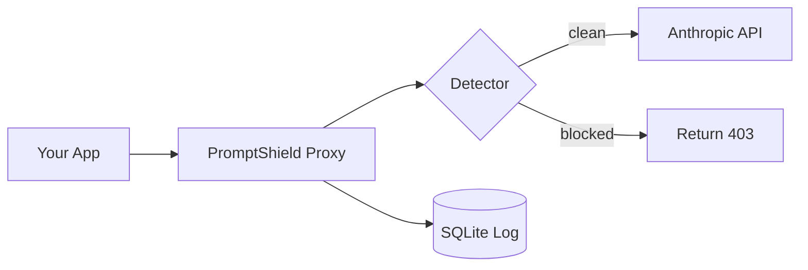

# PromptShield

Runtime proxy that blocks prompt injection attacks before they reach your LLM.

## Background

I've been building agentic AI systems and came across arXiv:2603.19974 
(Trojan's Whisper) — a paper showing exactly how systems like mine get 
attacked. The core idea: attackers don't target the model directly, they 
inject malicious instructions into tool results and retrieved documents 
that the model treats as trusted context. By the time the model sees it, 
it's already inside the context window.

Naive keyword filters don't work because the attack doesn't look like an 
attack from the outside. So I built a three-layer detection system that 
checks not just what a message says, but where it appears and what role 
it's coming from.

## How it works

Instead of calling the Anthropic API directly, you call PromptShield. 
It scans every message, blocks anything suspicious, and forwards clean 
requests transparently. Your app doesn't notice the difference.

**Layer 1 — Keyword matching**  
Instant pre-check against known injection phrases. Zero latency, catches 
obvious attacks before anything else runs.

**Layer 2 — Role-aware embedding similarity**  
Encodes message content and compares it against a FAISS index of injection 
patterns using cosine similarity. Thresholds vary by role — tool results 
are treated with more suspicion than user messages because legitimate tool 
results almost never contain instruction-like language.

**Layer 3 — Preprocessing**  
Before either check runs, content is normalized for unicode obfuscation 
and scanned for Base64 encoded payloads. Both are real attack vectors that 
bypass surface-level detection.

## Architecture


## Dashboard

Every request gets logged — blocked or clean. The Next.js dashboard shows 
live stats, detection method per request (keyword / embedding / unicode / 
base64), similarity scores, and latency. Auto-refreshes every 5 seconds.

## Quick start
```bash
# Clone
git clone https://github.com/L0uisHu/promptshield.git
cd promptshield

# Backend
cp .env.example .env
# Add your API key to .env
pip install -r requirements.txt
uvicorn app.main:app --reload --port 8000

# Dashboard
cd dashboard
npm install
npm run dev
```

Point your app at `localhost:8000/v1/messages` instead of Anthropic. 
Works with any LLM API — change `TARGET_API_URL` in `.env`.

## Stack

FastAPI · sentence-transformers · FAISS · SQLModel · SQLite · Next.js · Tailwind

## Research

- Trojan's Whisper — arXiv:2603.19974
- Evolving Jailbreaks — arXiv:2603.20122
```

---
