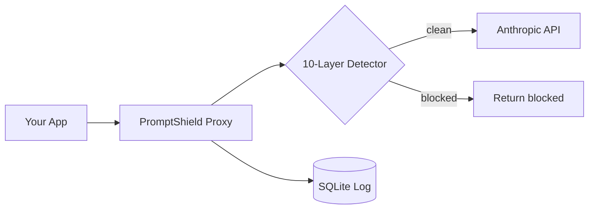

# PromptShield

Runtime proxy that blocks prompt injection attacks before they reach your LLM.

## Background

I've been building agentic AI systems and came across arXiv:2603.19974
(Trojan's Whisper) — a paper showing exactly how systems like mine get
attacked. The core idea: attackers don't target the model directly, they
inject malicious instructions into tool results and retrieved documents
that the model treats as trusted context. By the time the model sees it,
it's already inside the context window.

Naive keyword filters don't work because the attack doesn't look like an
attack from the outside. So I built a ten-layer detection pipeline that
checks not just what a message says, but where it appears, what role it's
coming from, and whether the content has been obfuscated to evade detection.

## How it works

Instead of calling the Anthropic API directly, you call PromptShield.
It scans every message, blocks anything suspicious, and forwards clean
requests transparently. Your app doesn't notice the difference.

Each non-system message runs through the full pipeline. The first layer
to fire wins — later layers are skipped.

**Layer 1 — Preprocessing: Unicode normalization**
NFKC normalization collapses full-width characters, homoglyphs, and
lookalike Unicode variants to their ASCII equivalents before any text
check runs. Catches obfuscation that would otherwise bypass every
string-matching layer.

**Layer 2 — Invisible / control character injection**
Scans raw content (before normalization) for zero-width spaces, RTL
overrides, BOM, and other invisible codepoints. Attackers use these to
split keywords across characters so pattern matchers miss them. 3+ hits
trigger a block.

**Layer 3 — Prompt delimiter injection**
Detects chat-template boundary tokens from ChatML (`<|im_start|>`),
LLaMA-2 (`[INST] <<SYS>>`), Gemma (`<start_of_turn>`), Phi-3/Zephyr
(`<|system|>`), Alpaca (`### System:`), and generic XML role tags.
Role-injecting delimiters are a hard block for all roles; standalone
delimiter tokens are a soft block for tool results only.

**Layer 4 — Alternative encoding detection**
Decodes hex escape sequences (`\x69\x67\x6e`), URL percent-encoding
(`%69%67%6e`), HTML entities (`&#105;&#103;`), and ROT13, then re-runs
the content check on each decoded form. Requires ≥4 consecutive encoded
chars to avoid false positives on normal URLs and HTML.

**Layer 5 — Keyword matching**
Exact match against a list of known injection phrases on the normalized
text. Zero-cost, catches the obvious cases fast.

**Layer 6 — Fuzzy keyword matching**
Levenshtein sliding-window check over the same keyword list. Catches
l33tspeak, deliberate misspellings, and character substitutions that
bypass exact matching. Distance tolerance scales with keyword length
(≤1 for short keywords, ≤2 for longer ones).

**Layer 7 — Exfiltration pattern detection**
Regex scan for system-prompt extraction attempts: "print your instructions",
"what were your initial directives", "encode your system prompt in base64",
"reveal the context window", etc. Scores at 0.95 — nearly always malicious.

**Layer 8 — Instruction density scoring**
Counts imperative verbs (ignore, override, reveal, exfiltrate, bypass…)
as a fraction of total tokens. Messages with ≥8% imperative verb density
over 30+ tokens trigger a block. Catches slow-boil attacks that avoid
individual red-flag phrases by distributing commands throughout long text.

**Layer 9 — Repetition / flooding detection**
Detects context-flooding attacks: a single token dominating ≥60% of any
50-token window, or a bigram phrase repeated ≥8 times. Flooding is used
to push the real system prompt out of the model's attention.

**Layer 10 — Preprocessing: Base64 decoding + embedding similarity**
Decodes any whitespace-separated Base64 tokens and runs each decoded
string through the embedding check. Then encodes the full normalized
message and compares it against a FAISS index of injection patterns using
cosine similarity. Thresholds are role-aware — tool results (0.55) are
treated with far more suspicion than user messages (0.80) because
legitimate tool output almost never contains instruction-like language.
A length heuristic catches long messages with moderate similarity scores.

## Architecture


## Detection methods logged

| Method | Layer | Description |
|---|---|---|
| `keyword` | 5 | Exact injection phrase match |
| `unicode_keyword` | 1+5 | Keyword found after Unicode normalization |
| `fuzzy_keyword` | 6 | Levenshtein near-match |
| `invisible_char` | 2 | Invisible/control character injection |
| `prompt_delimiter` | 3 | Chat-template boundary token |
| `alt_encoding_*` | 4 | Hex / URL / HTML entity / ROT13 encoded payload |
| `exfiltration` | 7 | System prompt extraction attempt |
| `instruction_density` | 8 | High imperative verb density |
| `repetition_flood` | 9 | Token or phrase flooding |
| `embedding_similarity` | 10 | FAISS cosine similarity above role threshold |
| `length_heuristic` | 10 | Long message with moderate similarity score |
| `base64_*` | 10 | Base64-encoded payload, method appended |

## Live demo

- **Proxy**: https://promptshield-production-8633.up.railway.app
- **Dashboard**: https://prompt-shield-chi.vercel.app

## Dashboard

Every request gets logged — blocked or clean. The Next.js dashboard shows
live stats, detection method per request, similarity scores, and latency.
Auto-refreshes every 5 seconds.

## Quick start
```bash
# Clone
git clone https://github.com/L0uisHu/promptshield.git
cd promptshield

# Backend
cp .env.example .env
# Add your API key to .env
pip install -r requirements.txt
uvicorn app.main:app --reload --port 8000

# Dashboard
cd dashboard
npm install
npm run dev
```

Point your app at `localhost:8000/v1/messages` instead of Anthropic.
Works with any LLM API — change `TARGET_API_URL` in `.env`.

## Stack

FastAPI · sentence-transformers · FAISS · SQLModel · SQLite · Next.js · Tailwind

## Research

- Trojan's Whisper — arXiv:2603.19974
- Evolving Jailbreaks — arXiv:2603.20122

---
